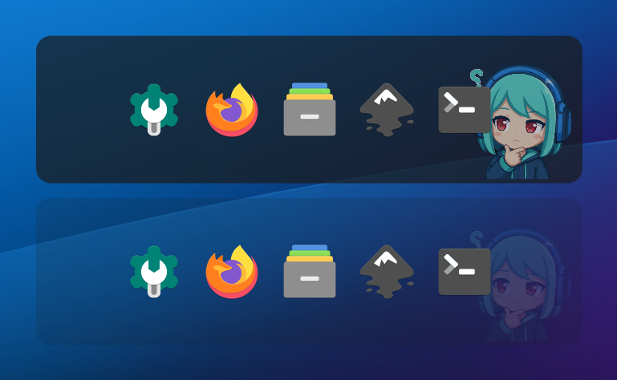

# Vira Dock

<p align="center">
  <br>

<br></p>
<br>
A simple lightweight, standalone application launcher and dock widget for KDE Plasma 6 with custom mascot. Specifically for KDE Plasma 6 using QML and JavaScript.
<br>
<p align="center">
  <br><br>
</p>

## Features
- **Custom Mascot Integration:** Features Vira integrated into the corner of the dock.
- **Customization:** Adjustable background opacity slider and option to toggle or use a custom avatar image. You can also disable the mascot and just have a plain background.
- **Drag-and-Drop:** Easily add your favorite applications by dragging their shortcuts into the dock.
- **Custom Icon Picker:** Fix broken or unknown application icons (`?`) manually by right-clicking and choosing any custom image (`.png`, `.svg`, `.webp`).
- **Lightweight & Fast:** Built entirely using QML and Kirigami, keeping resource usage to a minimum.

## Installation

Download the latest `vira-dock.plasmoid` from the [Releases](https://github.com/Motivabit/vira-dock/releases) page, then run:
```
kpackagetool6 -t Plasma/Applet -i vira-dock.plasmoid
```
This will install the plasmoid locally in your home directory
